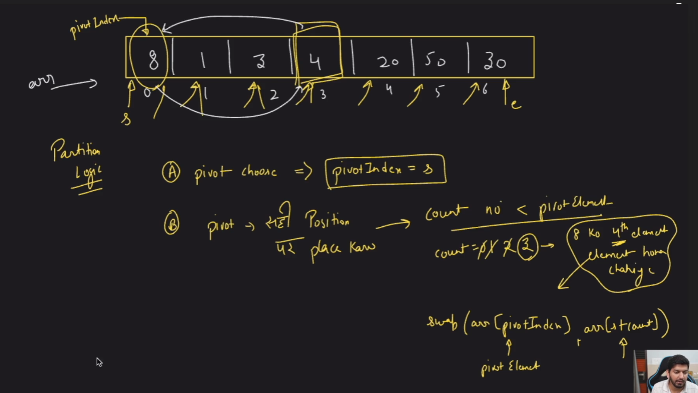
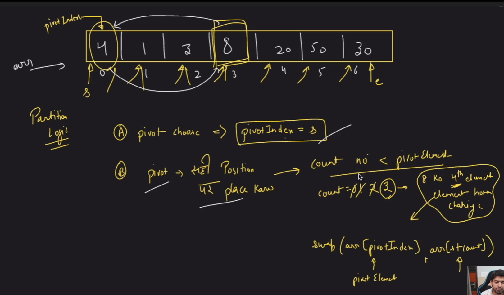
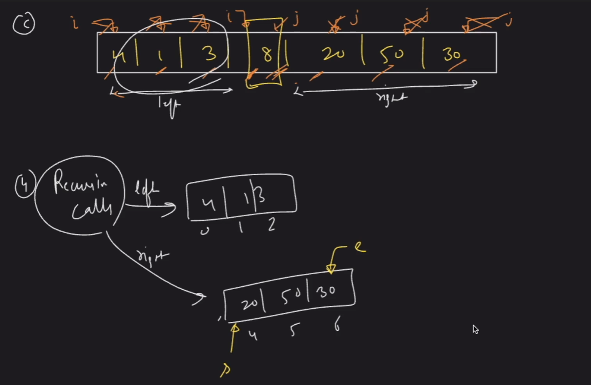
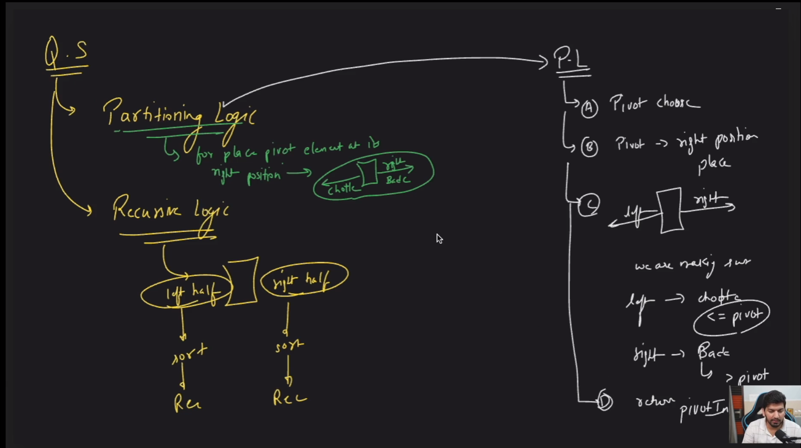

### Quick Sort
### Step 1

### Step 2




Sure, here are the steps for how the Quick Sort algorithm works based on the provided C++ code:

### Quick Sort Working Steps

1. **Choose a Pivot Element:**
   - Select the first element of the array segment as the pivot element.

2. **Partition the Array:**
   - **Count Elements Less Than or Equal to Pivot:**
     - Traverse the array segment from the start+1 to end.
     - Count how many elements are less than or equal to the pivot element.
   - **Position Pivot Element:**
     - Calculate the correct position of the pivot element based on the count of smaller elements.
     - Swap the pivot element with the element at this calculated position.
   - **Rearrange Elements:**
     - Initialize two pointers: one starting from the beginning (`i`) and one from the end (`j`) of the array segment.
     - Move the left pointer `i` to the right until an element greater than the pivot is found.
     - Move the right pointer `j` to the left until an element less than or equal to the pivot is found.
     - Swap the elements at `i` and `j` if `i` is less than the pivot index and `j` is greater than the pivot index.
     - Continue this process until the pointers `i` and `j` cross each other.
   - **Return Pivot Index:**
     - Return the index of the pivot element after partitioning.

3. **Recursive Quick Sort:**
   - **Base Case:** If the start index is greater than or equal to the end index, return (the array segment is already sorted).
   - **Partition:**
     - Partition the array and get the pivot index.
   - **Sort Left Subarray:**
     - Recursively apply Quick Sort to the subarray left of the pivot element.
   - **Sort Right Subarray:**
     - Recursively apply Quick Sort to the subarray right of the pivot element.

### Detailed Steps Based on Code:

1. **Initialization in Main:**
   - Define the array to be sorted: `int arr[] = {8, 1, 3, 4, 20, 50, 30, 550, 50, 50, 30};`
   - Determine the size of the array: `int n = sizeof(arr) / sizeof(int);`
   - Set start and end indices: `int s = 0; int e = n - 1;`
   - Call `quickSort(arr, s, e);`

2. **Partition Function:**
   - **Choosing Pivot:**
     - `int pivotElement = arr[s];` (Choose the first element as the pivot)
   - **Finding Right Position:**
     - Count elements less than or equal to pivot:
       ```cpp
       int count = 0;
       for (int i = s + 1; i <= e; i++) {
         if (arr[i] <= pivotElement) {
           count++;
         }
       }
       ```
     - Calculate the correct position for pivot and swap:
       ```cpp
       int rightIndex = s + count;
       swap(arr[pivotIndex], arr[rightIndex]);
       pivotIndex = rightIndex;
       ```
   - **Rearranging Elements:**
     - Initialize two pointers `i` and `j`:
       ```cpp
       int i = s;
       int j = e;
       while (i < pivotIndex && j > pivotIndex) {
         while (arr[i] <= pivotElement) {
           i++;
         }
         while (arr[j] > pivotElement) {
           j--;
         }
         if (i < pivotIndex && j > pivotIndex) {
           swap(arr[i], arr[j]);
         }
       }
       ```
   - **Return Pivot Index:**
     - `return pivotIndex;`

3. **Quick Sort Function:**
   - **Base Case:**
     ```cpp
     if (s >= e) {
       return;
     }
     ```
   - **Partition and Recursive Calls:**
     ```cpp
     int pivot = partition(arr, s, e);
     quickSort(arr, s, pivot - 1);
     quickSort(arr, pivot + 1, e);
     ```

4. **Printing the Sorted Array in Main:**
   - Loop through the sorted array and print each element:
     ```cpp
     for (int i = 0; i < n; i++) {
       cout << arr[i] << " ";
     }
     cout << endl;
     ```

     