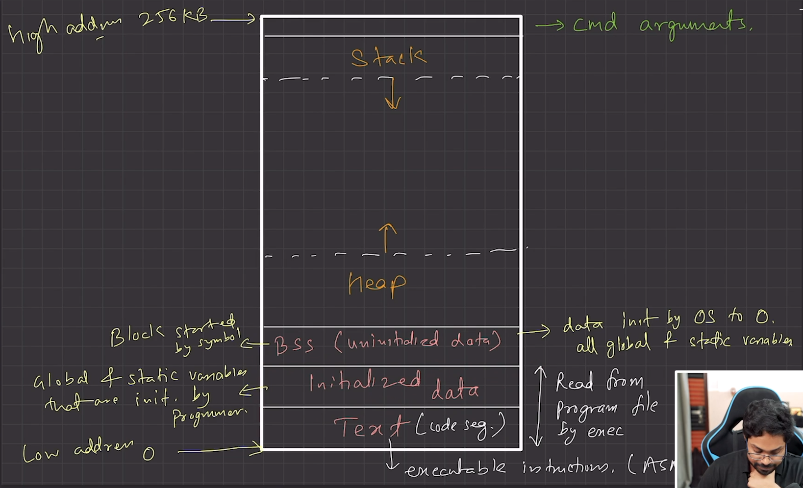
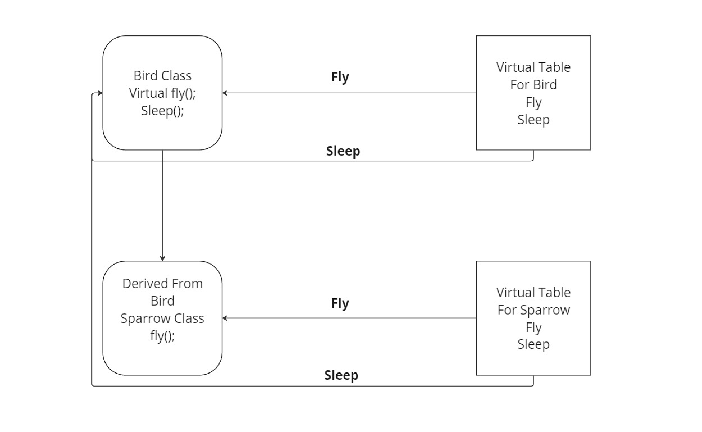
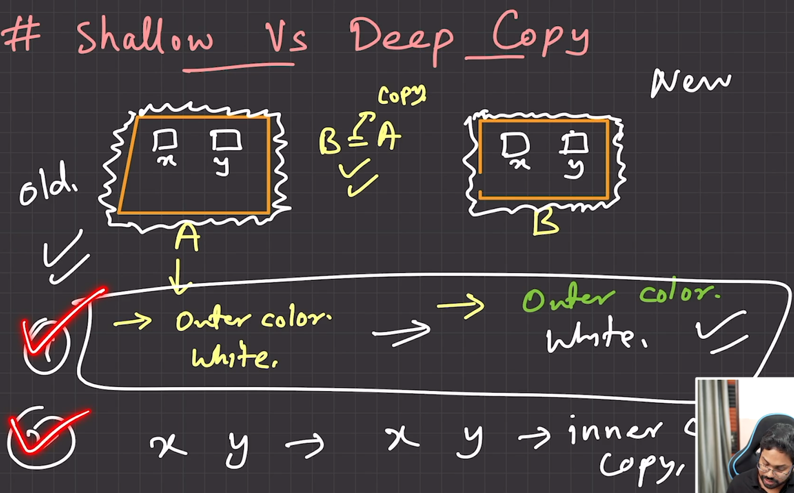

### Normal Member Functions
1. **Association with Object**:
   - Normal member functions are associated with a specific instance of a class.
   - They can access and modify the non-static data members of the class.

2. **Access to `this` Pointer**:
   - Normal member functions have access to the implicit `this` pointer, which points to the calling object.
   - This allows them to access and modify the object's non-static data members and other member functions.

3. **Call Syntax**:
   - They are called on objects using the dot operator (e.g., `obj.function()`).

4. **Instance Required**:
   - They require an instance of the class to be called.

### Static Member Functions
1. **Association with Class**:
   - Static member functions are associated with the class itself, rather than with any specific instance of the class.
   - They cannot access non-static data members directly because they do not have access to the `this` pointer.

2. **No `this` Pointer**:
   - Static member functions do not have access to the `this` pointer because they are not called on a specific object.
   - They can only access static data members and other static member functions of the class.

3. **Call Syntax**:
   - They can be called using the class name and scope resolution operator (e.g., `ClassName::function()`) or using an object (e.g., `obj.function()`, although this is less common).

4. **Instance Not Required**:
   - They can be called without creating an instance of the class.

### Example

```cpp
#include <iostream>
using namespace std;

class Example {
public:
    static int staticVar;
    int nonStaticVar;

    void normalFunction() const {
        cout << "Normal Function: " << nonStaticVar << ", " << staticVar << endl;
    }

    static void staticFunction() {
        // cout << nonStaticVar << endl; // Error: Cannot access non-static member
        cout << "Static Function: " << staticVar << endl;
    }
};

// Definition of static member variable
int Example::staticVar = 0;

int main() {
    Example obj1;
    obj1.nonStaticVar = 1;
    Example::staticVar = 10;

    obj1.normalFunction(); // Output: Normal Function: 1, 10
    Example::staticFunction(); // Output: Static Function: 10

    Example obj2;
    obj2.nonStaticVar = 2;
    Example::staticVar = 20;

    obj2.normalFunction(); // Output: Normal Function: 2, 20
    Example::staticFunction(); // Output: Static Function: 20

    return 0;
}
```

### Summary

- **Normal Member Functions**: Can access both static and non-static members, need an instance to be called, and have access to the `this` pointer.
- **Static Member Functions**: Can only access static members, can be called without an instance, and do not have access to the `this` pointer.


### Example Code

```cpp
#include <iostream>
using namespace std;

class Example {
public:
    int nonStaticVar;         // Normal data member
    static int staticVar;     // Static data member

    Example(int ns, int s) : nonStaticVar(ns) {
        // Non-static members are initialized per instance
    }
};

// Definition and initialization of static member variable
int Example::staticVar = 0;

int main() {
    Example obj1(1, 10);
    Example obj2(2, 20);

    obj1.nonStaticVar = 5;
    Example::staticVar = 10;

    cout << "obj1.nonStaticVar: " << obj1.nonStaticVar << endl;  // Output: 5
    cout << "obj2.nonStaticVar: " << obj2.nonStaticVar << endl;  // Output: 2

    cout << "obj1.staticVar: " << obj1.staticVar << endl;        // Output: 10
    cout << "obj2.staticVar: " << obj2.staticVar << endl;        // Output: 10

    Example::staticVar = 30;

    cout << "obj1.staticVar after change: " << obj1.staticVar << endl;  // Output: 30
    cout << "obj2.staticVar after change: " << obj2.staticVar << endl;  // Output: 30

    return 0;
}
```

### Summary

- **Normal Data Members**: Each instance of the class has its own copy, used for instance-specific data.
- **Static Data Members**: Only one copy exists, shared among all instances, used for class-wide data.


### Normal Data Members Vs Static Data Members:

| **Aspect**                       | **Normal Data Members**                                         | **Static Data Members**                                              |
|----------------------------------|-----------------------------------------------------------------|----------------------------------------------------------------------|
| **Association**                  | Associated with an instance of the class.                       | Associated with the class itself.                                     |
| **Storage**                      | Each instance of the class has its own copy.                    | Only one copy exists, shared among all instances of the class.        |
| **Initialization**               | Initialized when an instance of the class is created.           | Initialized outside the class definition, typically at file scope.    |
| **Access**                       | Accessed through an instance of the class.                      | Can be accessed through the class name using the scope resolution operator (e.g., `ClassName::member`). Can also be accessed through an instance of the class.|
| **Modification**                 | Each instance can have different values for normal data members.| Changes affect all instances since there's only one shared copy.      |
| **Usage**                        | Used for storing data specific to an instance.                  | Used for storing data common to all instances of the class.           |
| **Example**                      | `int nonStaticVar;`                                             | `static int staticVar;`                                               |

### Normal Member Functions Vs Static Member Functions:

| **Aspect**                       | **Normal Member Functions**                                        | **Static Member Functions**                                         |
|----------------------------------|--------------------------------------------------------------------|---------------------------------------------------------------------|
| **Association**                  | Associated with an instance of the class.                          | Associated with the class itself.                                   |
| **Access to `this` Pointer**     | Yes, has access to the `this` pointer.                             | No, does not have access to the `this` pointer.                     |
| **Access to Non-Static Members** | Can access and modify non-static data members.                     | Cannot access non-static data members directly.                     |
| **Access to Static Members**     | Can access static data members and functions.                      | Can access static data members and functions.                       |
| **Call Syntax**                  | Called on an object using the dot operator (e.g., `obj.function()`).| Called using the class name and scope resolution operator (e.g., `ClassName::function()`). Can also be called on an object (e.g., `obj.function()`).|
| **Instance Requirement**         | Requires an instance of the class to be called.                    | Does not require an instance of the class to be called.             |
| **Usage**                        | Used for operations specific to an instance of the class.          | Used for operations that are related to the class as a whole.       |


### Memory In Cpp



## Understanding the `virtual` Keyword in C++

**Before we dive into the code, let's clarify the purpose of the `virtual` keyword:**

- **Polymorphism:** It's essential for achieving runtime polymorphism, where the behavior of a function call can be determined at runtime based on the actual type of the object, not just its static type.
- **Base and Derived Classes:** It's typically used in conjunction with inheritance, where a base class declares a virtual function and derived classes can override it to provide their own implementations.

**Here's a C++ example:**

```cpp
#include <iostream>
using namespace std;

class Bird {
public:
    virtual void fly() {
        cout << "Bird flies in the sky." << endl;
    }

    void sleep() {
        cout << "Bird sleeps." << endl;
    }
};

class Sparrow : public Bird {
public:
    void fly() override {
        cout << "Sparrow flaps its wings." << endl;
    }
};

int main() {
    Bird *birdPtr = new Sparrow(); // Polymorphic pointer
    birdPtr->fly(); // Calls Sparrow's fly() due to virtual function
    birdPtr->sleep(); // Calls Bird's sleep() as it's not virtual

    delete birdPtr;
    return 0;
}
```

**Explanation:**

1. **Base Class `Bird`:**
   - Declares a `virtual` function `fly()`.
   - Declares a non-virtual function `sleep()`.

2. **Derived Class `Sparrow`:**
   - Overrides the `fly()` function.

3. **Main Function:**
   - Creates a pointer to a `Bird` object but points it to a `Sparrow` object (polymorphic pointer).
   - Calls `fly()` on the pointer. Since `fly()` is virtual, the derived class's implementation is called.
   - Calls `sleep()` on the pointer. Since `sleep()` is not virtual, the base class's implementation is called.

**Key Points:**

- The `virtual` keyword is used in the base class to declare a function as virtual.
- Derived classes can override virtual functions using the `override` keyword.
- A polymorphic pointer can point to objects of different derived classes, and the correct function will be called at runtime based on the actual object type.

**Note:** While the provided code matches the structure of the image you described, the actual content and behavior of the functions would depend on the specific requirements of your application.




### How Does `virtual` Work in C++?

1. **VTables**
    1. VTables are created for every class that has at least one virtual function, as well as for its derived classes.
    2. VTables are static arrays, so there is only one instance per class.
    3. The compiler adds a hidden member pointer, called the VPtr (Virtual Pointer), to classes with virtual functions and their derived classes.
    4. The VPtr is bound to the appropriate VTable based on the type of the object.

2. **VTable Creation**
    - VTables are created at compile time by the compiler.

3. **Object Creation and Initialization**
    - When an object of a class with virtual functions is created at runtime, it includes a VPtr.
    - The VPtr is initialized to point to the class's static VTable at the time of the object's construction.

### Can We Make a Virtual Constructor?

1. **No, Virtual Constructors Are Not Possible**:
    1. A constructor cannot be virtual because, when a class's constructor is executed, the virtual table (vtable) is not yet in memory, and no virtual pointer (vptr) is defined at that point. Therefore, constructors must always be non-virtual.
    2. The purpose of a virtual call is to allow work to be done with partial information, enabling function calls based on an interface without knowing the exact type of the object. However, creating an object requires complete information, including the exact type of the object to be created. As a result, a constructor call cannot be virtual.

### Shallow Copy

### Deep Copy



Here's a side-by-side comparison in tabular format between deep copy and shallow copy constructors, including the code and output:

| **Aspect**                  | **Shallow Copy**                                                                                                           | **Deep Copy**                                                                                                              |
|-----------------------------|----------------------------------------------------------------------------------------------------------------------------|----------------------------------------------------------------------------------------------------------------------------|
| **Class Definition**        | `class abc { ... };`                                                                                                       | `class abc { ... };`                                                                                                       |
| **Member Variables**        | `int x; int *y;`                                                                                                           | `int x; int *y;`                                                                                                           |
| **Constructor**             | `abc(int _x, int _y) : x(_x), y(new int(_y)) {}`                                                                           | `abc(int _x, int _y) : x(_x), y(new int(_y)) {}`                                                                           |
| **Shallow Copy Constructor**| ```cpp abc(const abc &obj) { x = obj.x; y = obj.y; } ```                                                                   |                                                                                                                            |
| **Deep Copy Constructor**   |                                                                                                                            | ```cpp abc(const abc &obj) { x = obj.x; y = new int(*obj.y); } ```                                                         |
| **Print Function**          | ```cpp void print() const { cout << "X: " << x << endl << "PTR Y: " << y << endl << "Content Of Y (*y): " << *y << endl; } ``` | ```cpp void print() const { cout << "X: " << x << endl << "PTR Y: " << y << endl << "Content Of Y (*y): " << *y << endl; } ``` |
| **Destructor**              | `~abc() { delete y; }`                                                                                                     | `~abc() { delete y; }`                                                                                                     |
| **Object Creation**         | ```cpp abc a(1, 2); a.print(); abc b = a; ```                                                                              | ```cpp abc a(1, 2); a.print(); abc b = a; ```                                                                              |
| **Output Before Modification**| ``` X: 1 PTR Y: 0x... Content Of Y (*y): 2 X: 1 PTR Y: 0x... Content Of Y (*y): 2 ```                                     | ``` X: 1 PTR Y: 0x... Content Of Y (*y): 2 X: 1 PTR Y: 0x... Content Of Y (*y): 2 ```                                      |
| **Modification**            | ```cpp *b.y = 10; ```                                                                                                      | ```cpp *b.y = 10; ```                                                                                                      |
| **Output After Modification**| ``` X: 1 PTR Y: 0x... Content Of Y (*y): 10 X: 1 PTR Y: 0x... Content Of Y (*y): 10 ```                                    | ``` X: 1 PTR Y: 0x... Content Of Y (*y): 10 X: 1 PTR Y: 0x... Content Of Y (*y): 2 ```                                      |
| **Potential Issue**         | **Double Free Error**                                                                                                      | **No Double Free Error**                                                                                                   |
| **Example Main Function**   | ```cpp int main() { abc a(1, 2); a.print(); abc b = a; cout << "Printing b" << endl; b.print(); *b.y = 10; cout << "Printing b" << endl; b.print(); cout << "Printing a" << endl; a.print(); return 0; } ``` | ```cpp int main() { abc a(1, 2); a.print(); abc b = a; cout << "Printing b" << endl; b.print(); *b.y = 10; cout << "Printing b" << endl; b.print(); cout << "Printing a" << endl; a.print(); return 0; } ``` |

### Shallow Copy Code

```cpp
#include <iostream>
using namespace std;

class abc {
public:
    int x;
    int *y;
    abc(int _x, int _y) : x(_x), y(new int(_y)) {}

    // Default Dumb Copy Constructor -> Shallow Copy
    abc(const abc &obj) {
        x = obj.x;
        y = obj.y;
    }

    void print() const {
        cout << "X: " << x << endl;
        cout << "PTR Y: " << y << endl;
        cout << "Content Of Y (*y): " << *y << endl;
    }

    ~abc() { delete y; }
};

int main() {
    abc a(1, 2);
    a.print();
    abc b = a; // Copy Constructor Call
    cout << "Printing b" << endl;
    b.print();
    *b.y = 10;
    cout << "Printing b" << endl;
    b.print();
    cout << "Printing a" << endl;
    a.print();

    return 0;
}
```

### Deep Copy Code

```cpp
#include <iostream>
using namespace std;

class abc {
public:
    int x;
    int *y;
    abc(int _x, int _y) : x(_x), y(new int(_y)) {}

    // Our Smart Deep Copy Constructor
    abc(const abc &obj) {
        x = obj.x;
        y = new int(*obj.y);
    }

    void print() const {
        cout << "X: " << x << endl;
        cout << "PTR Y: " << y << endl;
        cout << "Content Of Y (*y): " << *y << endl;
    }

    ~abc() { delete y; }
};

int main() {
    abc a(1, 2);
    a.print();
    abc b = a; // Copy Constructor Call
    cout << "Printing b" << endl;
    b.print();
    *b.y = 10;
    cout << "Printing b" << endl;
    b.print();
    cout << "Printing a" << endl;
    a.print();

    return 0;
}
```

### Output Comparison

| **Output**                  | **Shallow Copy**                                                                                                          | **Deep Copy**                                                                                                             |
|-----------------------------|---------------------------------------------------------------------------------------------------------------------------|---------------------------------------------------------------------------------------------------------------------------|
| **Initial Print**           | ``` X: 1 PTR Y: 0x... Content Of Y (*y): 2 X: 1 PTR Y: 0x... Content Of Y (*y): 2 ```                                       | ``` X: 1 PTR Y: 0x... Content Of Y (*y): 2 X: 1 PTR Y: 0x... Content Of Y (*y): 2 ```                                      |
| **After Modification**      | ``` X: 1 PTR Y: 0x... Content Of Y (*y): 10 X: 1 PTR Y: 0x... Content Of Y (*y): 10 ```                                     | ``` X: 1 PTR Y: 0x... Content Of Y (*y): 10 X: 1 PTR Y: 0x... Content Of Y (*y): 2 ```                                      |
| **Potential Issue**         | **Double Free Error** (if `abc *a = new abc(1, 2); abc b = *a; delete a;` is used)                                         | **No Double Free Error**                                                                                                   |
