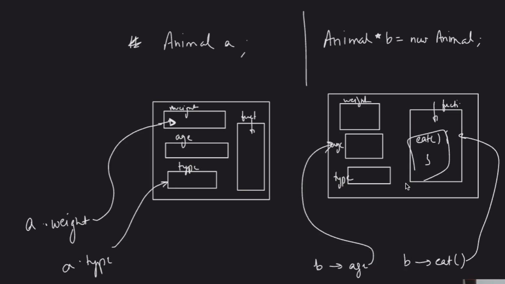
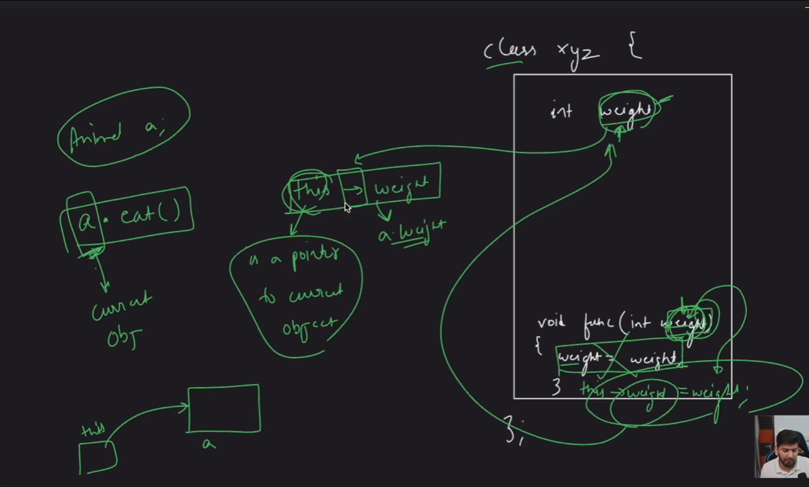
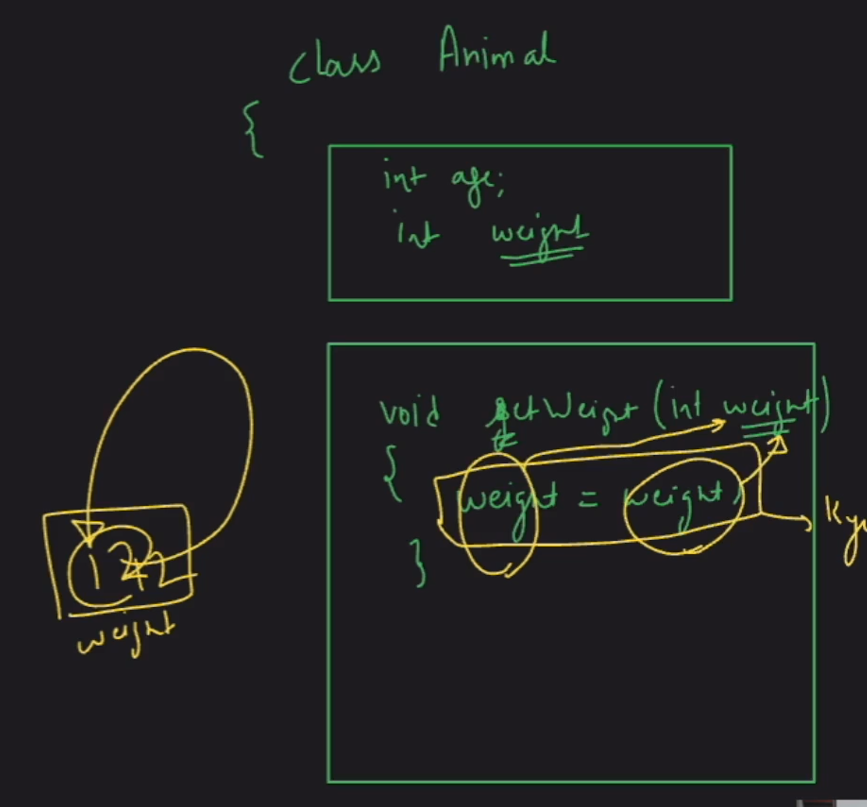
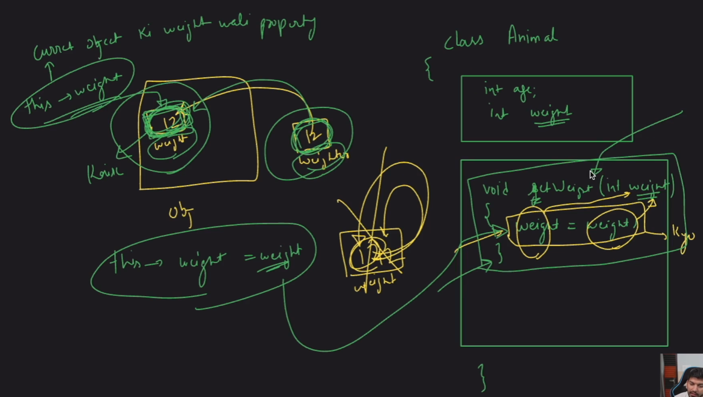
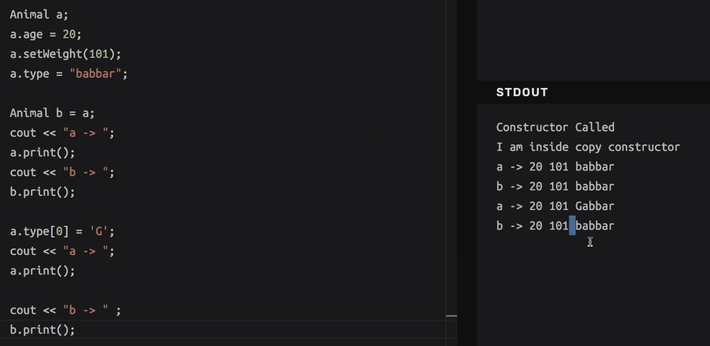

### Behind The Scenes 



### This Keyword





Sure, I'll add numbers to the code to make it clear which `weight` refers to which variable or parameter. Here's your modified code:

```cpp
class Animal {
public:
    string name;
    int age;
    int weight; // [1] Member variable 'weight'

    void setWeight(int weight) { // [2] Parameter 'weight'
        this->weight = weight; // 'this->weight' refers to [1], 'weight' refers to [2]
    }
};
```

### Explanation with Numbers

1. **Member Variable `weight`**:
   - `int weight;` // [1] This is the member variable of the class `Animal`.

2. **Parameter `weight`**:
   - `void setWeight(int weight) {` // [2] This is the parameter passed to the method `setWeight`.

3. **Inside the `setWeight` Method**:
   - `this->weight = weight;`:
     - `this->weight` refers to the member variable `[1]`.
     - `weight` refers to the parameter `[2]`.

### Visual Representation of `this`

Let's visualize an instance of the `Animal` class called `animal1`.

```cpp
Animal animal1;
animal1.setWeight(50);
```

**Object `animal1`**:
```
---------------------
| name: ...         |
| age: ...          |
| weight: 50        |  // [1] This is the member variable being set
---------------------
```

When `animal1.setWeight(50)` is called:
- The `weight` parameter in the method `setWeight` (inside the parentheses) is `50`.
- `this->weight` refers to the `weight` member variable of `animal1`.

### How `this` Works

- `this` is a pointer to the current object (`animal1` in this case).
- `this->weight` accesses the member variable `weight` of `animal1`.
- `weight` inside the `setWeight` method refers to the parameter passed to the method.

Using `this->weight` ensures that you are assigning the value of the parameter `weight` (50) to the member variable `weight` of the current object (`animal1`).

Sure! Let's use a simple visual analogy to explain the `this` keyword in object-oriented programming, specifically in the context of C++.

### The "Dabba" (Box) Method

Imagine each object in a class as a separate "dabba" (box). Each box has its own set of attributes (variables) and functions (methods). The `this` keyword is like a special label inside each box that points to the box itself. This helps the functions inside the box know which box they are currently working on.

### Example: A Class Representing a Box

Let's create a simple class called `Box` with attributes `length`, `width`, and `height`, and a method `calculateVolume` to compute the volume of the box.

```cpp
class Box {
public:
    int length;
    int width;
    int height;

    Box(int l, int w, int h) : length(l), width(w), height(h) {}

    int calculateVolume() {
        return this->length * this->width * this->height;
    }
};
```

### Visual Representation

1. **Two Objects of Class Box**:
   - `Box box1(2, 3, 4);`
   - `Box box2(5, 6, 7);`

2. **Visualizing the Dabbas**:

```
Box box1:
---------------------
| length: 2         |
| width: 3          |
| height: 4         |
| calculateVolume() |
| -> this = box1    |
---------------------

Box box2:
---------------------
| length: 5         |
| width: 6          |
| height: 7         |
| calculateVolume() |
| -> this = box2    |
---------------------
```

### Explaining `this` Keyword with Visuals

When you call `box1.calculateVolume()`, the `this` keyword inside `calculateVolume` method refers to `box1`. 

```
box1.calculateVolume() 
this->length * this->width * this->height 
= 2 * 3 * 4 = 24
```

When you call `box2.calculateVolume()`, the `this` keyword inside `calculateVolume` method refers to `box2`.

```
box2.calculateVolume() 
this->length * this->width * this->height 
= 5 * 6 * 7 = 210
```

### How `this` Works

- The `this` keyword is a pointer that refers to the current object.
- It helps differentiate between instance variables (attributes) and parameters or local variables with the same name.
- In `calculateVolume`, `this->length` refers to the `length` attribute of the object on which the method is called (`box1` or `box2`).

### Corrected Code:

```cpp
#include <iostream>
#include <string>
using namespace std;

class Animal {
public:
    string name;
    int age;
    int weight;

    // Default constructor
    Animal() : age(0), weight(0) {
        cout << "Default Constructor Called" << endl;
    }

    // Parameterized constructor 1
    Animal(int a) : age(a), weight(0) {
        cout << "Parameterized Constructor Called" << endl;
    }

    // Parameterized constructor 2
    Animal(int a, int w) : age(a), weight(w) {
        cout << "Parameterized Constructor 2 Called" << endl;
    }

    // Copy constructor
    Animal(const Animal &other) : name(other.name), age(other.age), weight(other.weight) {
        cout << "Copy Constructor Called" << endl;
    }
};

int main() {
    Animal a; // Default constructor called

    // Animal *b = new Animal(); -> Default Constructor Called
    Animal *b = new Animal(5); // Parameterized constructor called
    cout << "Parameterized Constructor Age: " << b->age << endl;

    Animal *c = new Animal(5, 10); // Parameterized constructor called
    cout << "Parameterized Constructor 2 Age: " << c->age << endl;
    cout << "Parameterized Constructor 2 Weight: " << c->weight << endl;

    // Good Practice -> To Make Constructor
    // Classes Are There So -> High Chance That Initialization Of Object Will Be
    // Done In Constructor

    // Copy Constructor -> 2 Ways
    Animal d = a; // Copy constructor called
    Animal f(a);  // Copy constructor called
    Animal g(*b); // Copy constructor called

    // Cleanup dynamically allocated memory
    delete b;
    delete c;

    return 0;
}
```

### Explanation:

1. **Default Constructor**:
    - `Animal() : age(0), weight(0) { cout << "Default Constructor Called" << endl; }`
    - Initializes `age` and `weight` to `0`.

2. **Parameterized Constructor 1**:
    - `Animal(int a) : age(a), weight(0) { cout << "Parameterized Constructor Called" << endl; }`
    - Initializes `age` to `a` and `weight` to `0`.

3. **Parameterized Constructor 2**:
    - `Animal(int a, int w) : age(a), weight(w) { cout << "Parameterized Constructor 2 Called" << endl; }`
    - Initializes `age` to `a` and `weight` to `w`.

4. **Copy Constructor**:
    - `Animal(const Animal &other) : name(other.name), age(other.age), weight(other.weight) { cout << "Copy Constructor Called" << endl; }`
    - Initializes the new object with the values of another `Animal` object.

5. **Object Creation**:
    - `Animal a;` calls the default constructor.
    - `Animal *b = new Animal(5);` calls the parameterized constructor.
    - `Animal *c = new Animal(5, 10);` calls the parameterized constructor 2.

6. **Copy Constructors**:
    - `Animal d = a;` calls the copy constructor.
    - `Animal f(a);` calls the copy constructor.
    - `Animal g(*b);` calls the copy constructor.

7. **Memory Cleanup**:
    - Always delete dynamically allocated memory to avoid memory leaks: `delete b;` and `delete c;`.

By following this approach, you ensure that the constructors are properly utilized, and memory management is correctly handled in your C++ program.

