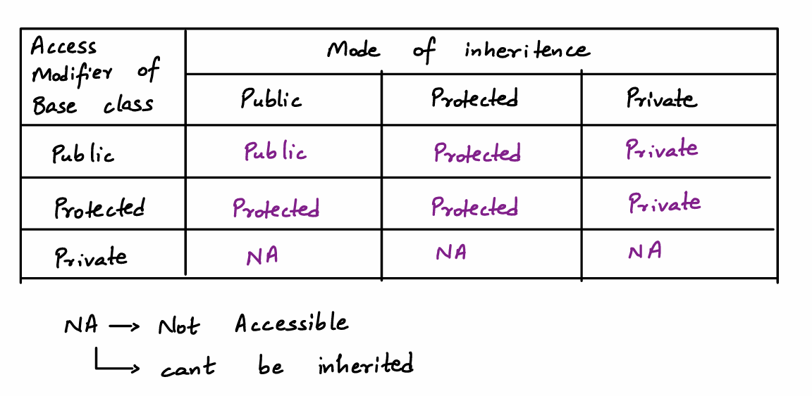
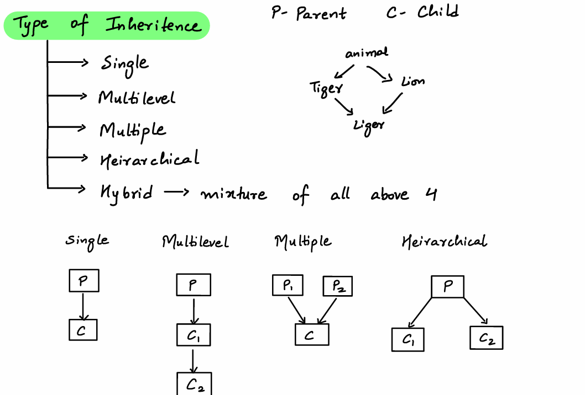
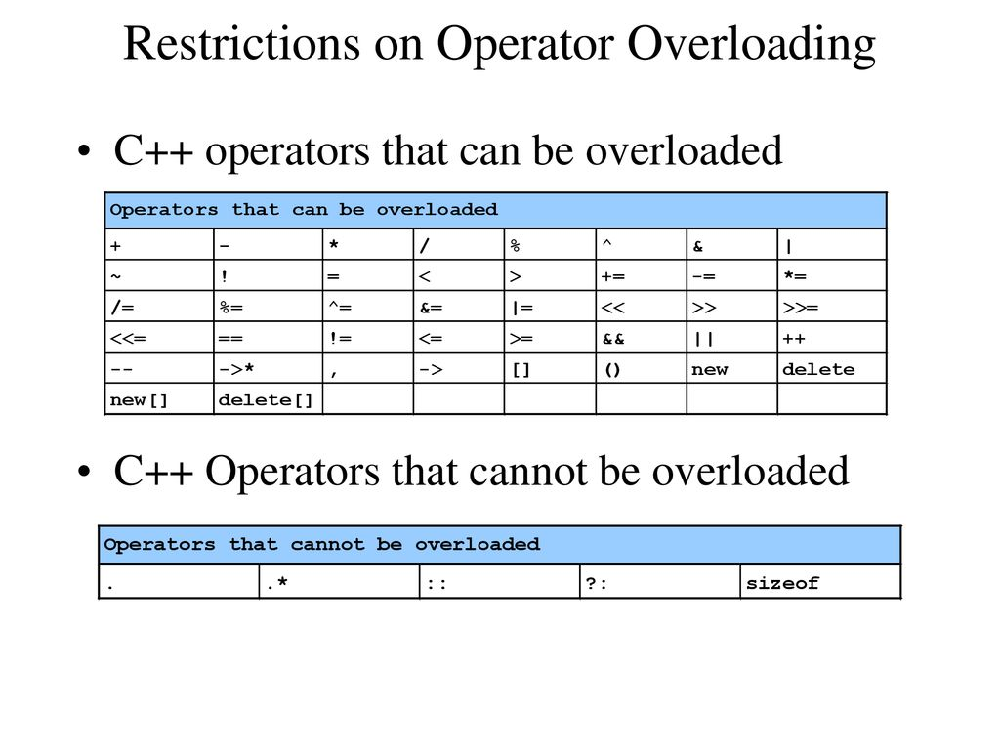

In C++, access modifiers define the visibility and accessibility of class members (data members and member functions). There are three access modifiers:

1. **Public**:
   - Members declared as `public` are accessible from outside the class.
   - They can be accessed using the object of the class.
   - Typically, functions that need to be accessed by other classes or outside functions are declared public.

   Example:
   ```cpp
   class Example {
   public:
       int publicVar;
       void publicFunction() {
           cout << "This is a public function." << endl;
       }
   };

   int main() {
       Example obj;
       obj.publicVar = 10; // Accessible
       obj.publicFunction(); // Accessible
       return 0;
   }
   ```

2. **Private**:
   - Members declared as `private` are only accessible within the class itself.
   - They cannot be accessed directly from outside the class, not even by derived classes.
   - Typically used for internal data and functions that should not be exposed.

   Example:
   ```cpp
   class Example {
   private:
       int privateVar;
       void privateFunction() {
           cout << "This is a private function." << endl;
       }

   public:
       void setPrivateVar(int value) {
           privateVar = value;
       }
       int getPrivateVar() {
           return privateVar;
       }
   };

   int main() {
       Example obj;
       // obj.privateVar = 10; // Error: Not accessible
       obj.setPrivateVar(10); // Indirectly accessible through public functions
       cout << "PrivateVar: " << obj.getPrivateVar() << endl;
       return 0;
   }
   ```

3. **Protected**:
   - Members declared as `protected` are accessible within the class itself and by derived classes.
   - They are not accessible from outside the class.
   - Typically used when you want to allow derived classes to access and modify certain data, but keep it hidden from outside code.

   Example:
   ```cpp
   class Base {
   protected:
       int protectedVar;

   public:
       void setProtectedVar(int value) {
           protectedVar = value;
       }
   };

   class Derived : public Base {
   public:
       void useProtectedVar() {
           protectedVar = 20; // Accessible in derived class
           cout << "ProtectedVar: " << protectedVar << endl;
       }
   };

   int main() {
       Derived obj;
       // obj.protectedVar = 30; // Error: Not accessible directly
       obj.setProtectedVar(10); // Accessible through public function
       obj.useProtectedVar(); // Accessible in derived class
       return 0;
   }
   ```

### Summary

- **Public**: Accessible from outside the class.
- **Private**: Accessible only within the class itself.
- **Protected**: Accessible within the class itself and by derived classes.



Inheritance is a fundamental concept in object-oriented programming that allows one class to inherit properties and behavior (methods) from another class. Here's a detailed explanation of the types of inheritance in C++ along with code examples:

### 1. Single Inheritance

A class inherits from one base class.

```cpp
#include <iostream>
using namespace std;

class Base {
public:
    void display() {
        cout << "Base class display function" << endl;
    }
};

class Derived : public Base {
public:
    void show() {
        cout << "Derived class show function" << endl;
    }
};

int main() {
    Derived obj;
    obj.display();
    obj.show();
    return 0;
}
```

### 2. Multiple Inheritance

A class inherits from more than one base class.

```cpp
#include <iostream>
using namespace std;

class Base1 {
public:
    void display() {
        cout << "Base1 class display function" << endl;
    }
};

class Base2 {
public:
    void show() {
        cout << "Base2 class show function" << endl;
    }
};

class Derived : public Base1, public Base2 {
public:
    void print() {
        cout << "Derived class print function" << endl;
    }
};

int main() {
    Derived obj;
    obj.display();
    obj.show();
    obj.print();
    return 0;
}
```

### 3. Multilevel Inheritance

A class is derived from a class which is also derived from another class.

```cpp
#include <iostream>
using namespace std;

class Base {
public:
    void display() {
        cout << "Base class display function" << endl;
    }
};

class Intermediate : public Base {
public:
    void show() {
        cout << "Intermediate class show function" << endl;
    }
};

class Derived : public Intermediate {
public:
    void print() {
        cout << "Derived class print function" << endl;
    }
};

int main() {
    Derived obj;
    obj.display();
    obj.show();
    obj.print();
    return 0;
}
```

### 4. Hierarchical Inheritance

Multiple classes inherit from a single base class.

```cpp
#include <iostream>
using namespace std;

class Base {
public:
    void display() {
        cout << "Base class display function" << endl;
    }
};

class Derived1 : public Base {
public:
    void show() {
        cout << "Derived1 class show function" << endl;
    }
};

class Derived2 : public Base {
public:
    void print() {
        cout << "Derived2 class print function" << endl;
    }
};

int main() {
    Derived1 obj1;
    Derived2 obj2;
    obj1.display();
    obj1.show();
    obj2.display();
    obj2.print();
    return 0;
}
```

### 5. Hybrid Inheritance

A combination of more than one type of inheritance.

```cpp
#include <iostream>
using namespace std;

class Base {
public:
    void display() {
        cout << "Base class display function" << endl;
    }
};

class Derived1 : public Base {
public:
    void show() {
        cout << "Derived1 class show function" << endl;
    }
};

class Derived2 {
public:
    void print() {
        cout << "Derived2 class print function" << endl;
    }
};

class Hybrid : public Derived1, public Derived2 {
public:
    void hybridFunction() {
        cout << "Hybrid class function" << endl;
    }
};

int main() {
    Hybrid obj;
    obj.display();
    obj.show();
    obj.print();
    obj.hybridFunction();
    return 0;
}
```

### Summary

- **Single Inheritance**: One class inherits from one base class.
- **Multiple Inheritance**: One class inherits from more than one base class.
- **Multilevel Inheritance**: A class is derived from another derived class.
- **Hierarchical Inheritance**: Multiple classes inherit from a single base class.
- **Hybrid Inheritance**: A combination of two or more types of inheritance.


Polymorphism in C++ allows objects to be treated as instances of their base type rather than their actual derived type. It is a fundamental concept in object-oriented programming and can be classified into two types: Compile Time Polymorphism and Run Time Polymorphism.

### 1. Compile Time Polymorphism

Compile Time Polymorphism is achieved by function overloading and operator overloading.

#### a. Function Overloading

Function overloading allows multiple functions to have the same name but different parameters.

**Example:**

```cpp
#include <iostream>
using namespace std;

class Print {
public:
    void print(int i) {
        cout << "Printing int: " << i << endl;
    }

    void print(double f) {
        cout << "Printing float: " << f << endl;
    }

    void print(string s) {
        cout << "Printing string: " << s << endl;
    }
};

int main() {
    Print obj;
    obj.print(5);
    obj.print(500.263);
    obj.print("Hello C++");
    return 0;
}
```

In this example, the `print` function is overloaded to accept an integer, a double, and a string. The correct version of the function is called based on the argument passed.

#### b. Operator Overloading

Operator overloading allows custom implementation for operators in a class.

**Example:**

```cpp
#include <iostream>
using namespace std;

class Complex {
private:
    float real;
    float imag;
public:
    Complex() : real(0), imag(0) {}
    Complex(float r, float i) : real(r), imag(i) {}

    // Operator overloading
    Complex operator + (const Complex& obj) {
        Complex temp;
        temp.real = real + obj.real;
        temp.imag = imag + obj.imag;
        return temp;
    }

    void display() {
        cout << "Real: " << real << " Imaginary: " << imag << endl;
    }
};

int main() {
    Complex c1(3.4, 5.6), c2(2.3, 4.5);
    Complex c3 = c1 + c2;
    c3.display();
    return 0;
}
```

In this example, the `+` operator is overloaded to add two `Complex` numbers. The overloaded operator function `operator+` takes a `Complex` object as a parameter, adds the corresponding real and imaginary parts, and returns a new `Complex` object.

### 2. Run Time Polymorphism

Run Time Polymorphism is achieved through inheritance and virtual functions. It allows a function to behave differently based on the object that invokes it.

#### Example:

```cpp
#include <iostream>
using namespace std;

class Base {
public:
    virtual void show() {
        cout << "Base class show function" << endl;
    }
};

class Derived : public Base {
public:
    void show() override {
        cout << "Derived class show function" << endl;
    }
};

int main() {
    Base* bptr;
    Derived d;
    bptr = &d;

    bptr->show(); // Calls the Derived class show function
    return 0;
}
```

In this example, the `show` function in the `Base` class is declared as `virtual`, allowing it to be overridden in the `Derived` class. The `bptr` pointer of type `Base` is assigned the address of the `Derived` object. When `bptr->show()` is called, the `show` function of the `Derived` class is executed, demonstrating run-time polymorphism.

### Summary

- **Compile Time Polymorphism**: Achieved using function overloading and operator overloading.
- **Function Overloading**: Multiple functions with the same name but different parameters.
- **Operator Overloading**: Custom implementation for operators in a class.
- **Run Time Polymorphism**: Achieved using inheritance and virtual functions. Allows functions to behave differently based on the object that invokes them.

These concepts enable C++ to support polymorphism, allowing for more flexible and reusable code.

Sure, let's include the `Maths` class demonstrating function overloading for `sum` functions.

```cpp
#include <iostream>
using namespace std;

// Function Overloading Example
class Maths {
public:
    // Function to calculate sum of two integers
    int sum(int a, int b) {
        return a + b;
    }

    // Function to calculate sum of three integers
    int sum(int a, int b, int c) {
        return a + b + c;
    }

    // Function to calculate sum of an integer and a float
    float sum(int a, float b) {
        return a + b;
    }
};

int main() {
    Maths obj;

    cout << "Sum of 3 and 4: " << obj.sum(3, 4) << endl;
    cout << "Sum of 3, 4 and 5: " << obj.sum(3, 4, 5) << endl;
    cout << "Sum of 3 and 4.5: " << obj.sum(3, 4.5f) << endl;

    return 0;
}
```

### Explanation of the `Maths` Class

The `Maths` class demonstrates function overloading by providing three different versions of the `sum` method:

1. **Sum of Two Integers**
   ```cpp
   int sum(int a, int b) {
       return a + b;
   }
   ```
   This method takes two integers as arguments and returns their sum.

2. **Sum of Three Integers**
   ```cpp
   int sum(int a, int b, int c) {
       return a + b + c;
   }
   ```
   This method takes three integers as arguments and returns their sum.

3. **Sum of an Integer and a Float**
   ```cpp
   float sum(int a, float b) {
       return a + b;
   }
   ```
   This method takes an integer and a float as arguments and returns their sum.

### Usage in `main`

In the `main` function, we create an object `obj` of the `Maths` class and call the `sum` method with different sets of parameters:

```cpp
int main() {
    Maths obj;

    cout << "Sum of 3 and 4: " << obj.sum(3, 4) << endl;
    cout << "Sum of 3, 4 and 5: " << obj.sum(3, 4, 5) << endl;
    cout << "Sum of 3 and 4.5: " << obj.sum(3, 4.5f) << endl;

    return 0;
}
```

- **`obj.sum(3, 4)`**: Calls the method that sums two integers.
- **`obj.sum(3, 4, 5)`**: Calls the method that sums three integers.
- **`obj.sum(3, 4.5f)`**: Calls the method that sums an integer and a float.

By using function overloading, the `Maths` class allows for multiple `sum` methods with different parameters, showcasing compile-time polymorphism - function Based.

